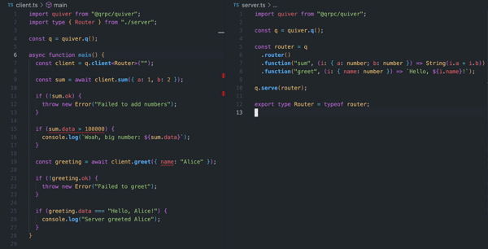

<p align="center">
  
  <h1 align="center">Quiver</h1>
</p>
<br/>
<p align="center">
<a href="https://opensource.org/licenses/MIT" rel="nofollow"></a>
<a href="https://twitter.com/killthebuddha_" rel="nofollow"></a>
<a href="https://github.com/killthebuddh4/quiver" rel="nofollow"></a>
</p>

<div align="center">
<h2>a dead-simple 😵, secure 🔐, type-safe 🦄 RPC client and server<br />powered by the <a href="https://xmtp.org">XMTP</a> messaging protocol.<br /><br /></h2>
</div>

<div align="center">
  <a href="https://github.com/killthebuddh4/quiver#api-reference">Documentation</a>
  <span>&nbsp;&nbsp;•&nbsp;&nbsp;</span>
  <a href="https://discord.gg/TODO">Discord</a>
  <span>&nbsp;&nbsp;•&nbsp;&nbsp;</span>
  <a href="https://www.npmjs.com/package/@qrpc/quiver">npm</a>
  <span>&nbsp;&nbsp;•&nbsp;&nbsp;</span>
  <a href="https://github.com/killthebuddh4/quiver/issues/new">Issues</a>
  <span>&nbsp;&nbsp;•&nbsp;&nbsp;</span>
  <a href="https://twitter.com/killthebuddh4_">@killthebuddha_</a>
  <span>&nbsp;&nbsp;•&nbsp;&nbsp;</span>
  <a href="https://github.com/killthebuddh4/fig">fig</a>
  <br />
  <br />
  <figure>
    
  </figure>
</div>

## Quickstart

`npm install @qrpc/quiver` or `yarn add @qrpc/quiver` or `pnpm add @qrpc/quiver`

1. Serve a function.
2. Call the function.
3. That's it!

```JavaScript
// server.ts

import quiver from "@qrpc/quiver";
import { xmtp } from "./xmtp.js";

const q = quiver.q();
q.serve(() => 42);

console.log(`Server running at ${q.address}`)
```

```JavaScript
// client.ts

import quiver from "@qrpc/quiver";

const q = quiver.q();
const client = q.client(process.env.SERVER_ADDRESS);
const answer = await client();

console.log(answer.data); // 42
```

That's all there is to it 🎉, you've just _deployed a function to the internet, and called that function, in ~10 lines of code!_ No DNS, AWS, GCP, LOL, or WTF's involved! To learn more, keep on reading! To see more advanced examples, jump ahead to the [Advanced Examples](#advanced-examples) section. If you're wondering where the magic happens, jump to [Under the Hood](#under-the-hood).

## Table of Contents

- [Quickstart](#quickstart)
- [Table of Contents](#table-of-contents)
- [Features](#features)
- [Basic Usage](#basic-usage)
  - [Functions](#functions)
  - [Routers](#routers)
  - [Middleware and Context](#middleware-and-context)
  - [TypeScript!](#typescript)
  - [XMTP Network Client](#xmtp-network-client)
- [Middleware Guide](#middleware-guide)
  - [Merging Middleware](#merging-middleware)
- [API Reference](#api-reference)
  - [`Quiver`](#quiver)
  - [`QuiverRouter`](#quiverrouter)
  - [`QuiverFunction`](#quiverfunction)
  - [`QuiverClient`](#quiverclient)
  - [`QuiverMiddleware`](#quivermiddleware)
  - [`QuiverProvider`](#quiverprovider)
- [Off-the-Shelf Middlewares](#off-the-shelf-middlewares)
- [Advanced Examples](#advanced-examples)
- [Under the Hood](#under-the-hood)
- [Roadmap](#roadmap)

## Features

`quiver` is an extremely simple way to rapidly build and deploy services to the internet. It's powered by [XMTP](https://xmtp.org) and inspired by [trpc](https://trpc.io).

- __Type-Safe Client/Server__
- __Type-Safe Middleware__
- __Fluent builder APIs__
- __End-to-End Encryption__
- __Dead-Simple__

## Basic Usage

### Functions

`quiver` lets you rapidly build secure client/server applications. The simplest server is just a function. A `QuiverFunction` can take 0, 1, or 2 arguments and optionally return a value. We always refer to the first argument as `props` and the second argument as `context`. Here's a simple example without:

```JavaScript
// server.ts

import quiver from "@qrpc/quiver";

const q = quiver.q();

q.serve((props: { a: number, b: number }) => {
  return add(props);
});
```

### Routers

You'll probably want to serve more than just a single function. You can do this by using a `QuiverRouter`. `quiver` provides a type-safe fluent-style builder API for constructing routers. Here's a simple example:

```JavaScript
// server.ts

import { q } from "./q";

const router = q.router()
  .function("a", () => "a")
  .function("b", () => "b")

q.serve(router);
```

And your client can call these functions:

```JavaScript
// client.ts

import { q } from "./q";

const client = q.client(process.env.SERVER_ADDRESS);

const a = await client.a(); // { data: "a" }
const b = await client.b(); // { data: "b" }
```

Routers can of course be nested into a tree structure. Here's an example:

```JavaScript
// router.ts

import { q } from "./q";

const hello = q.router()
  .function("a", () => "hello from a")
  .function("b", () => "hello from b")

const goodbye = q.router()
  .function("a", () => "goodbye from a")
  .function("b", () => "goodbye from b")

export const router = q.router()
  .router("hello", hello)
  .router("goodbye", goodbye)

```

And now your client mirrors the structure of the server:

```JavaScript

// client.ts

import { q } from "./q";

const client = q.client(process.env.SERVER_ADDRESS);

await client.hello.a(); // { data: "hello from a" }
await client.hello.b(); // { data: "hello from b" }
await client.goodbye.a(); // { data: "goodbye from a" }
await client.goodbye.b(); // { data: "goodbye from b" }
```

### Middleware and Context

`quiver` provides a simple but powerful middleware system. A `QuiverMiddleware` is a function that takes 0 or 1 arguments and optionally returns an object. We always refer to the argument as `context`. Here's a simple example:

```JavaScript

// middleware.ts

import { q } from "./q";

const logger = q.middleware(ctx => {
  console.log(ctx);
});

```

We can attach middleware to router and functions with `use`:

```JavaScript
import { q } from "./q";
import { logger, timestamp } from "./middleware";
import { fn } from "./fn";
import { router } from "./router";

const fnWithTimestamp = fn.use(logger);
const routerWithLogger = router.use(logger);
const root = routerWithLogger.function("fn", fnWithTimestamp);
q.serve(root);
```

When a `quiver` server receives a request, it derives a default context object from the request and then passes it through the server's middleware. More details on this process can be found in the [Middleware](#middleware) section.

### TypeScript!

`quiver`'s entire backend API is fully type-safe by default as long as you annotate all arguments. `quiver`'s client API (`q.client`) is also fully type-safe whenever you provide the backend's type to the client. Here's an example of how to provide the backend's type to the client:

```TypeScript

// router.ts

import { q } from "./q";

const router = q.router()
  .function("a", (i: { name: string }) => `hello, ${i.name}`)
  .function("b", () => "hello from b")

// Export the type of the router

export type Router = typeof router;

q.serve(router);
```


```TypeScript

// client.ts

// Import the Router type
import type { Router } from "./router";
import { q } from "./q";

// Notice the generic here.
const client = q.client<Router>(process.env.SERVER_ADDRESS);
```

Now your client is type-safe! If you try to call a function that doesn't exist, you'll get a TypeScript error, if you pass the wrong arguments, you'll get a TypeScript error, and the return value's `data` field will be correctly typed!

### XMTP Network Client

So far in all the examples, an XMTP network client is created inside our initial call to `quiver.q()`. This means that your server is listening to a random address. You'll probably want to re-use the same address (at least in production). You can do this by manually initializing XMTP and passing it to `quiver`. Here's how:

```JavaScript
// server.ts

import quiver from "@qrpc/quiver";

const xmtp = quiver.x({ init: { key: process.env.XMTP_SECRET_KEY } });

const q = quiver.q({ xmtp });

q.serve(() => 42);
```

Now the server will be running at whatever address corresponds to your `XMTP_SECRET_KEY`, and you can call it:

```JavaScript
// client.ts

import quiver from "@qrpc/quiver";

const quiver = quiver.q();

const client = quiver.client(process.env.SERVER_ADDRESS);

const answer = await client(); // { data: 42 }
```

## Middleware Guide

`quiver` supports a simple but powerful type-safe middleware API. A `QuiverMiddleware` is essentially a function that optinally takes a context object and optionally returns a context object. When a middleware takes a context object, we say it "reads" from the context. When a middleware returns a context object, we say it "writes" to the context. We think of it this way because each middleware's return value is merged into the context which it receives.


```JavaScript

// middleware.ts

import { q } from "./q";

const logger = q.middleware(ctx => {
  console.log(ctx);
});

const timestamp = q.middleware(() => {
  return {
    timestamp: Date.now(),
  };
});

```

To use a middleware in your server, you attach it to a `QuiverRouter` or `QuiverFunction`. Here's an example with a router:

```JavaScript

import { logger } from "./middleware";

const router = q.router()
  .use(logger)
  .function("a", () => "a")
  .function("b", () => "b")

```

`quiver`'s middleware system is type-safe. If you try to bind incompatible routes to a router with middleware, you'll get a TypeScript error:

```TypeScript

import { q } from "./q";

const passesAString = q.middleware(ctx => {
  return {
    a: "a",
  };
});

const needsANumber = (i: undefined, ctx: { a: number }) => {
  // ...
}

const router = q.router()
  .use(passesAString)
  // Boom! TypeScript error!
  .function("a", needsANumber)

```

### Merging Middleware

Middleware can be merged in a type-safe manner using `mw.extend(other)` and `mw.pipe(other)`. `extend` can be thought of as "parallel merge" and `pipe` can be thought of as "sequential merge". Some examples:

```TypeScript

import { q } from "./q";

const a = q.middleware(() => {
  return { a: Math.random(), };
});

const b = q.middleware(() => {
  return { b: Math.random(), };
});

const sum = q.middleware((ctx: { a: number, b: number }) => {
  return {
    sum: ctx.a + ctx.b,
  };
});

export const merged = a.extend(b).pipe(sum);

```

## API Reference

__TODO__

### `Quiver`

### `QuiverRouter`

### `QuiverFunction`

### `QuiverClient`

### `QuiverMiddleware`

### `QuiverProvider`

## Off-the-Shelf Middlewares

From the `quiver` team:

__TODO__

From the community:

__TODO__

## Advanced Examples

__TODO__

Check out these runnable examples:

- Hello, world!
- Using quiver with [React](https://react.dev)
- ENS authentication
- Peer-to-peer, serverless Tic-Tac-Toe
- Type-Safety

If you have a use-case in mind, and are wondering how it might work, don't hesitate to [open an issue](TODO), join the [discord](TODO), or DM [@killthebuddha_](https://x.com/killthebuddha_) on X.

## Under the Hood

__TODO__

`Quiver` is built on top of the superb [XMTP](https://xmtp.org) messaging protocol. XMTP provides out-of-the-box end-to-end encrypted messaging.

## Roadmap

__TODO__

Right now we're currently on the _path to v0._

If you have a feature (or bugfix) request, don't hesitate to [open an issue](TODO) or DM [@killthebuddha_](https://x.com/killthebuddha_) on X.


